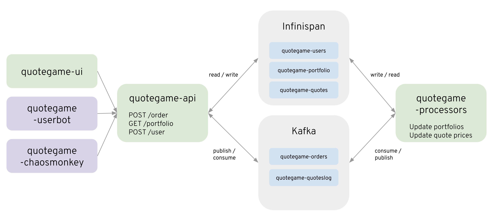
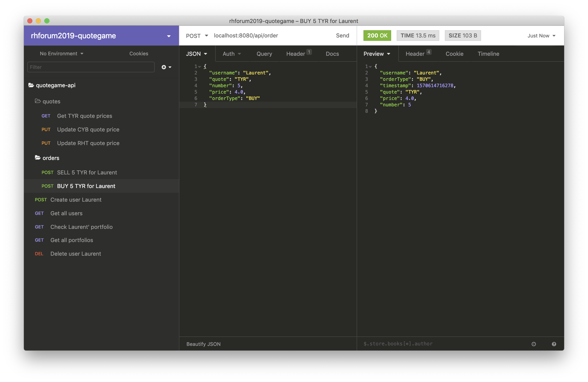

# rhforum2019-quotegame

A stock quote game illustrating Red Hat middleware portfolio around Kafka, Quarkus and Drools.

## What is it?

## Architecture

Here's the architecture components diagram of this repository.

This stock quote game is using Infini span and Kafla as data sources backend. Infinispan distributed data grid is used for storing mutable and highly volatile informations like the users informations, the users portfolio and the current prices of all the managed quote symbols. Kafka on the other hand is used to as an append-only logs to store immutable events like user's orders and quotes prices history. 



Application main business components are here represented in green:
* The `quotegame-ui` is obviously the one holding the User Interface that is mobile friendly,
* The `quotegame-api` microservice holds the REST APIs for interacting with the application. It allows basically to register user, post orders and check portfolio symbols and values. It mainly read informations from Infinispan caches and publish new order events into Kafka,
* The `quotegame-processors` microservice holds the update logic for both portfolio and stock pricess. It reacts on incoming events consumed into Kafka and update portfolio and quote values in Infinispan.

Application also had extra components here represented in purple. They help demonstrating application under huge load and unexpected events:
* The `quotegame-userbot` can be used to simulate hundreds or thousands of users playing with the game,
* The `quotegame-chaosmonkey` can be used to simulate unstability and uncertainty on the market trends. It can be used to simulate crisis ;-)


## How to build/contribute?

Requirements:
* Java 1.8.0+
* Maven 3.6.0+
* Docker for desktop 18.09+
 
### Build the maven modules

```sh
$ mvn clean install -DskipTests
[INFO] Scanning for projects...
[INFO] ------------------------------------------------------------------------
[INFO] Reactor Build Order:
[INFO] 
[INFO] quotegame-model                                                    [jar]
[INFO] quotegame-api                                                      [jar]
[INFO] quotegame-processors                                               [jar]
[INFO] quotegame-parent                                                   [pom]
[...]
[INFO] Reactor Summary for quotegame-parent 1.0-SNAPSHOT:
[INFO] 
[INFO] quotegame-model .................................... SUCCESS [  1.777 s]
[INFO] quotegame-api ...................................... SUCCESS [  0.775 s]
[INFO] quotegame-processors ............................... SUCCESS [  0.588 s]
[INFO] quotegame-parent ................................... SUCCESS [  0.004 s]
[INFO] ------------------------------------------------------------------------
[INFO] BUILD SUCCESS
[INFO] ------------------------------------------------------------------------
[INFO] Total time:  3.381 s
[INFO] Finished at: 2019-08-12T11:39:07+02:00
[INFO] ------------------------------------------------------------------------
```

### Launch in development mode

In a first terminal, launch Kafka message broker using `kafka.sh` script:

```sh
$ ./kafka.sh
Starting rhforum-2019_zookeeper_1 ... done
Starting rhforum-2019_kafka_1     ... done
Attaching to rhforum-2019_zookeeper_1, rhforum-2019_kafka_1
zookeeper_1  | [2019-08-12 09:41:04,575] INFO Reading configuration from: config/zookeeper.properties (org.apache.zookeeper.server.quorum.QuorumPeerConfig)
[...]
kafka_1      | [2019-08-12 09:41:08,348] INFO Kafka version : 2.1.0 (org.apache.kafka.common.utils.AppInfoParser)
kafka_1      | [2019-08-12 09:41:08,348] INFO Kafka commitId : 809be928f1ae004e (org.apache.kafka.common.utils.AppInfoParser)
kafka_1      | [2019-08-12 09:41:08,351] INFO [KafkaServer id=0] started (kafka.server.KafkaServer)
```

In a second terminal, launch Infispan data grid server using `infinispan.sh` script:

```sh
$ ./infinispan.sh
################################################################################
# No application user and/or password provided.                                #
# Application user and password has been generated.                            #
# Application user: vAr294HdjR                                                 #
# Application password: bcmDD5RXSq                                             #
#                                                                              #
[...]
09:44:40,078 INFO  [org.jboss.as] (Controller Boot Thread) WFLYSRV0060: Http management interface listening on http://0.0.0.0:9990/management
09:44:40,078 INFO  [org.jboss.as] (Controller Boot Thread) WFLYSRV0051: Admin console listening on http://0.0.0.0:9990
09:44:40,079 INFO  [org.jboss.as] (Controller Boot Thread) WFLYSRV0025: Infinispan Server 10.0.0.Beta3 (WildFly Core 6.0.2.Final) started in 7612ms - Started 186 of 199 services (57 services are lazy, passive or on-demand)
```

You'll just have to hit `Ctrl+C` when wanting to stop these process.

From a terminal window in the `quotegame-ui` folder, launch the Angular app:

```sh
$ ng serve                                                                                         
 10% building 4/4 modules 0 activeℹ ｢wds｣: Project is running at http://localhost:4200/webpack-dev-server/
ℹ ｢wds｣: webpack output is served from /
ℹ ｢wds｣: 404s will fallback to //index.html
                                                                                                                                                                                 
chunk {main} main.js, main.js.map (main) 48.7 kB [initial] [rendered]
chunk {polyfills} polyfills.js, polyfills.js.map (polyfills) 296 kB [initial] [rendered]
chunk {polyfills-es5} polyfills-es5.js, polyfills-es5.js.map (polyfills-es5) 474 kB [initial] [rendered]
chunk {runtime} runtime.js, runtime.js.map (runtime) 6.09 kB [entry] [rendered]
chunk {scripts} scripts.js, scripts.js.map (scripts) 178 kB [entry] [rendered]
chunk {styles} styles.js, styles.js.map (styles) 1.26 MB [initial] [rendered]
chunk {vendor} vendor.js, vendor.js.map (vendor) 6.27 MB [initial] [rendered]
Date: 2019-09-17T09:26:41.477Z - Hash: 46d0d9e48ab0c8537a3e - Time: 7393ms
** Angular Live Development Server is listening on localhost:4200, open your browser on http://localhost:4200/ **
ℹ ｢wdm｣: Compiled successfully.
```

From another terminal window in the `quotegame-api` folder, launch the Quarkus app:

```sh
$ mvn compile quarkus:dev 
[INFO] Scanning for projects...
[INFO] 
[INFO] -----------------< com.redhat.quotegame:quotegame-api >-----------------
[...]
2019-08-12 11:48:02,701 INFO  [org.inf.cli.hot.RemoteCacheManager] (main) ISPN004021: Infinispan version: 10.0.0.Beta3
2019-08-12 11:48:03,166 INFO  [QuoteGameApp] (main) Create or get caches named quotegame-users, quotegame-portfolios with the default configuration
2019-08-12 11:48:03,263 INFO  [io.quarkus] (main) Quarkus 0.20.0 started in 2.880s. Listening on: http://[::]:8080
2019-08-12 11:48:03,263 INFO  [io.quarkus] (main) Installed features: [cdi, infinispan-client, resteasy, resteasy-jackson, smallrye-context-propagation, smallrye-reactive-messaging, smallrye-reactive-messaging-kafka, smallrye-reactive-streams-operators, vertx]
```

From another terminal window in the `quotegame-processors` folder, launch the Quarkus app:

```sh
$ mvn compile quarkus:dev           
[INFO] Scanning for projects...
[INFO] 
[INFO] -------------< com.redhat.quotegame:quotegame-processors >--------------
[INFO] Building quotegame-processors 1.0-SNAPSHOT
[INFO] --------------------------------[ jar ]---------------------------------
[INFO] 
[INFO] --- maven-resources-plugin:2.6:resources (default-resources) @ quotegame-processors ---
[INFO] Using 'UTF-8' encoding to copy filtered resources.
[INFO] Copying 6 resources
[INFO] 
[INFO] --- maven-compiler-plugin:3.1:compile (default-compile) @ quotegame-processors ---
[INFO] Changes detected - recompiling the module!
[INFO] Compiling 4 source files to /Users/lbroudou/Development/github/rhforum-2019/quotegame-processors/target/classes
[INFO] 
[INFO] --- quarkus-maven-plugin:0.20.0:dev (default-cli) @ quotegame-processors ---
[ERROR] Port 5005 in use, not starting in debug mode
2019-08-12 11:52:05,910 INFO  [io.qua.dep.QuarkusAugmentor] (main) Beginning quarkus augmentation
2019-08-12 11:52:08,421 INFO  [io.qua.dep.QuarkusAugmentor] (main) Quarkus augmentation completed in 2511ms
2019-08-12 11:52:08,907 INFO  [io.sma.rea.mes.ext.MediatorManager] (main) Deployment done... start processing
2019-08-12 11:52:08,911 INFO  [io.sma.rea.mes.imp.ConfiguredChannelFactory] (main) Found incoming connectors: [smallrye-kafka]
2019-08-12 11:52:08,911 INFO  [io.sma.rea.mes.imp.ConfiguredChannelFactory] (main) Found outgoing connectors: [smallrye-kafka]
2019-08-12 11:52:08,911 INFO  [io.sma.rea.mes.imp.ConfiguredChannelFactory] (main) Stream manager initializing...
[...]
2019-08-12 11:52:09,177 INFO  [org.apa.kaf.cli.con.KafkaConsumer] (vert.x-kafka-consumer-thread-0) [Consumer clientId=consumer-1, groupId=orders-4-portfolio] Subscribed to topic(s): quotegame-orders
2019-08-12 11:52:09,191 INFO  [org.apa.kaf.cli.con.KafkaConsumer] (vert.x-kafka-consumer-thread-1) [Consumer clientId=consumer-2, groupId=orders-4-quoteprice] Subscribed to topic(s): quotegame-orders
2019-08-12 11:52:09,192 INFO  [io.quarkus] (main) Quarkus 0.20.0 started in 3.473s. Listening on: http://[::]:8081
2019-08-12 11:52:09,194 INFO  [io.quarkus] (main) Installed features: [cdi, infinispan-client, kogito, resteasy, resteasy-jackson, resteasy-jsonb, smallrye-context-propagation, smallrye-reactive-messaging, smallrye-reactive-messaging-kafka, smallrye-reactive-streams-operators, vertx]
2019-08-12 11:52:09,400 INFO  [org.apa.kaf.cli.Metadata] (vert.x-kafka-consumer-thread-0) Cluster ID: uBgdb-csSS6jFTuNhPsCbA
2019-08-12 11:52:09,400 INFO  [org.apa.kaf.cli.Metadata] (vert.x-kafka-consumer-thread-1) Cluster ID: uBgdb-csSS6jFTuNhPsCbA
2019-08-12 11:52:09,411 INFO  [org.apa.kaf.cli.con.int.AbstractCoordinator] (vert.x-kafka-consumer-thread-1) [Consumer clientId=consumer-2, groupId=orders-4-quoteprice] Discovered group coordinator localhost:9092 (id: 2147483647 rack: null)
2019-08-12 11:52:09,411 INFO  [org.apa.kaf.cli.con.int.AbstractCoordinator] (vert.x-kafka-consumer-thread-0) [Consumer clientId=consumer-1, groupId=orders-4-portfolio] Discovered group coordinator localhost:9092 (id: 2147483647 rack: null)
2019-08-12 11:52:09,414 INFO  [org.apa.kaf.cli.con.int.ConsumerCoordinator] (vert.x-kafka-consumer-thread-0) [Consumer clientId=consumer-1, groupId=orders-4-portfolio] Revoking previously assigned partitions []
2019-08-12 11:52:09,414 INFO  [org.apa.kaf.cli.con.int.ConsumerCoordinator] (vert.x-kafka-consumer-thread-1) [Consumer clientId=consumer-2, groupId=orders-4-quoteprice] Revoking previously assigned partitions []
2019-08-12 11:52:09,414 INFO  [org.apa.kaf.cli.con.int.AbstractCoordinator] (vert.x-kafka-consumer-thread-0) [Consumer clientId=consumer-1, groupId=orders-4-portfolio] (Re-)joining group
2019-08-12 11:52:09,414 INFO  [org.apa.kaf.cli.con.int.AbstractCoordinator] (vert.x-kafka-consumer-thread-1) [Consumer clientId=consumer-2, groupId=orders-4-quoteprice] (Re-)joining group
2019-08-12 11:52:09,623 INFO  [org.apa.kaf.cli.con.int.AbstractCoordinator] (vert.x-kafka-consumer-thread-0) [Consumer clientId=consumer-1, groupId=orders-4-portfolio] Successfully joined group with generation 3
2019-08-12 11:52:09,623 INFO  [org.apa.kaf.cli.con.int.AbstractCoordinator] (vert.x-kafka-consumer-thread-1) [Consumer clientId=consumer-2, groupId=orders-4-quoteprice] Successfully joined group with generation 3
2019-08-12 11:52:09,624 INFO  [org.apa.kaf.cli.con.int.ConsumerCoordinator] (vert.x-kafka-consumer-thread-0) [Consumer clientId=consumer-1, groupId=orders-4-portfolio] Setting newly assigned partitions: quotegame-orders-0
2019-08-12 11:52:09,624 INFO  [org.apa.kaf.cli.con.int.ConsumerCoordinator] (vert.x-kafka-consumer-thread-1) [Consumer clientId=consumer-2, groupId=orders-4-quoteprice] Setting newly assigned partitions: quotegame-orders-0
```

You can now start playing around with the application! For ease of use an [Insomnia](https://insomnia.rest/) workspace is available [here](./insomnia-workspace.yaml). Just import it into Insomnia and you'll get some tests queries ready to use:



## How to run it for a demo?
