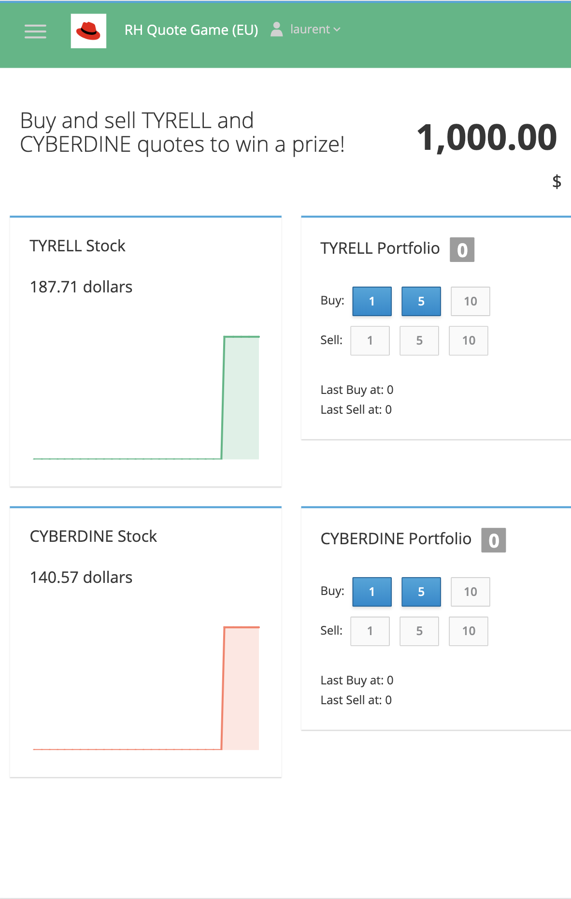
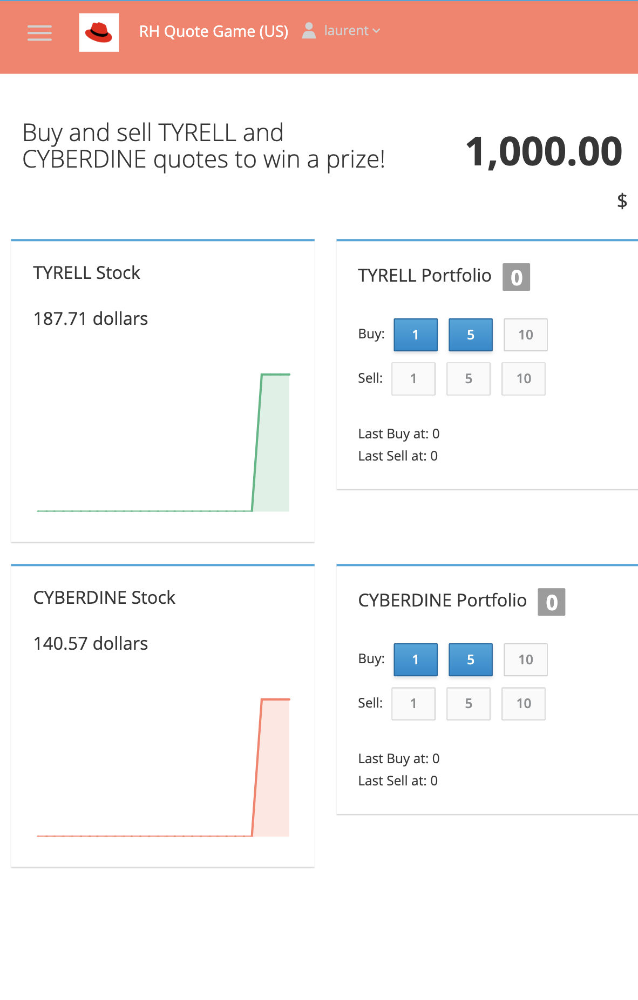
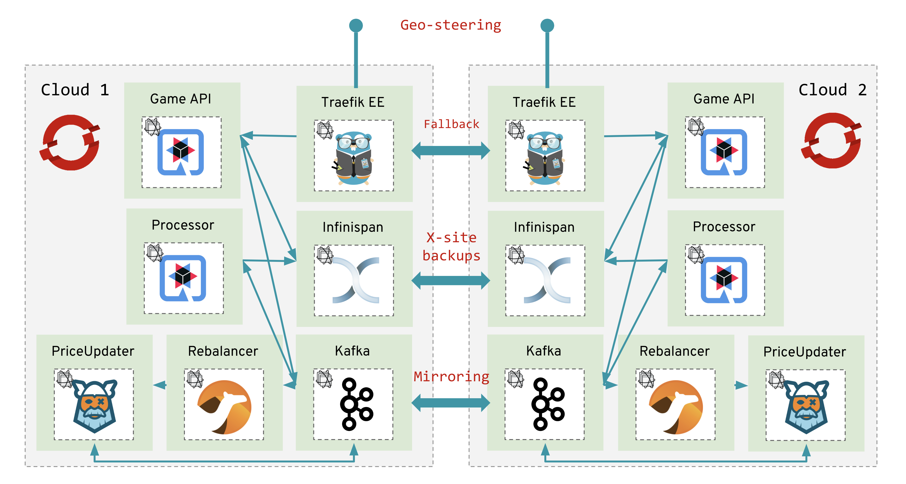

### Multi-cloud application view

The purpose of this `multi-cloud` branch and manifests is to adapt the application for being deployed multiple time on multiple cloud-providers and clusters in an active-active way. We provide configurations to deploy the application on 2 clusters dispatched on `EU` and `US` regions.

> The provided configuration can be extended to more than 2 clusters: the design of the application allow this flexibility.

From the user point of view, user will be edirected to one of this 2 clusters depending on its locality and cluster's availability.

| EU Cluster               |  US Cluster              |
:-------------------------:|:-------------------------:
|  |  |

> You can adapt the name of clusters and color of the navigation bar into the `quotegame-api-config` ConfigMap.

### Multi-cloud architecture

Here's the architecture diagram of the implementation of the application in multi-cloud mode:


The original architecture design has to evolve in order to support multi-cloud deployment.
Some informations on new components we have to introduce from original design:
* `quotegame-priceupdater`: This component was extracted from `quotegame-processors` in simple mode deployment. We extracted here the processing of new quote prices depending of sell and buy orders. This was necessary as the other part of the component in charge of portfolios update supported multiple consumers whereas this part clearly need to consume all the order events, coming from all clusters in the same place and correct order. Thus we also introduce the following component...
* `quotegame-rebalancer`: Is a routing component that receives order events on both clusters and takes care of rebalancing them to the currently active `master` among the different `quotegame-priceupdater` instances. This component uses EIP to do the rebalancing.

As `quotegame-priceupdater` supports some kind of `master`/`slaves` behaviour, when roles are changing and a new `master` emerged from `slaves`, the current instance should not start from scratch and should have all the working memory from previous `master` at hand, warm and ready to start. For that, we'll use a snapshoting/restoring mechanism based on Kafka mirroring. At each and every modification of a `quotegame-priceupdater master` working memory, a snapshot will be produced, sent and ingested by `slaves` to ensure a warm local working memory.


### Multi-cloud deployment options

#### Simple Load-Balancer Service type

This deployment options is using OpenShift built-in ingress capabilities through Routes or LoadBalancer Service type when required. It has been successfully deployed on 2 AWS clusters.

You can find all the instructions into the `aws-load-balancer` folder [here](./aws-load-balancer/README.md).

Though it has been tested on AWS, it should be transportable on some other cloud providers or on-premise setup with automatic external LoadBalancer configuration.

#### TraefikEE Ingress Controller with geo-steering and fallback

On top of the application deployed in 2 or more clusters, you can deploy TraefikEE that provides an elegant solution to gea-steering routing as well as fallbacks between the 2 clusters.

You can find all the instructions into the `traefik-ee` folder [here](./traefik-ee/README.md).

#### Using Skupper.io

Future plans involves using [Skupper](http://skupper.io) as a cross-cluster communication solution for securing transports between the 2 sites.

Partial support of Skupper is available for now. You can find all the instructions into the `skupper.io` folder [here](./skupper.io/README.md).

#### Using Submariner

Future plans involves using [Submariner](http://submariner.io) as a cross-cluster communication solution for securing transports between the 2 sites.

#### Using Istio Multicluster

Future plans involves using [Istio Multi-cluster](https://istio.io/docs/setup/install/multicluster/) as a cross-cluster communication solution for securing transports between the 2 sites.


### Demonstration scenario

#### Cluster failure

First login to `http://quotegame.redhat.containous.tech` and check the color of the screen and the cluster you're on (it may be green/EU or orange/US) depending on your location. Let call it `W1` for Window 1.

Open another browser window and connect to the other cluster using the OpenShift direct Route (`http://quotegame-api-quotegame.apps.cluster-paris-c03a.paris-c03a.example.opentlc.com/` for example). Let call it `W2` for Window 2.

On `W1`, connect as a user and buy a stock action. Do the same thing with same user on `W2`. Buy an action on `W1` and check the synchronisation of the portfolio on `W2`.

Now, simulate a cluster outage by removing the ping TraefikEE on the first cluster:

```
$ oc delete ingress/ping -n traefikee
ingress.extensions "ping" deleted
```

Then buy a new stock action on `W2`. After few seconds, synchronisation should have occured on the other way on `W1` thus because the Javascript part that was calling the service has been redirected to `W2` cluster API.

Now hit refresh on the `W1` brower and the header should change its color.

You could now relaunch the cluster by recreating the ping service:

```
$ cat <<EOF | oc create -n traefikee -f -
apiVersion: extensions/v1beta1
kind: Ingress
metadata:
  name: ping
  namespace: traefikee
  annotations:
    kubernetes.io/ingress.class: 'traefik'
spec:
  rules:
    - http:
        paths:
          - path: "/ping"
            backend:
              serviceName: traefikee-ping
              servicePort: 4545
EOF
```

Wait a few seconds before refreshing your browser `W1` and it should swicth back to first color.

#### API failure

First login to `http://quotegame.redhat.containous.tech` and check the color of the screen and the cluster you're on (it may be green/EU or orange/US) depending on your location. Let call it `W1` for Window 1.

On `W1`, connect as a user and buy a stock action see the stocks prices and open browser console on `Network` tab to see requests going out.

Now, simulate an API outage by scaling down the `quotegame-api` on the first cluster:

```
$ oc scale deployment/quotegame-api --replicas=0 -n quotegame
deployment.extensions/quotegame-api scaled
```

Once done, you should see one (or very little) errors on browser console before the TraefikEE Ingress controller detect API outage
and redirect to the API route on second cluster.

Now hit refresh on the `W1` brower and the header should change its color.

You could now relaunch the API by scaling up the deployment:

```
$ oc scale deployment/quotegame-api --replicas=01-n quotegame
deployment.extensions/quotegame-api scaled
```

#### PriceUpdater failure

First login to `http://quotegame.redhat.containous.tech` and check the color of the screen and the cluster you're on (it may be green/EU or orange/US) depending on your location. Let call it `W1` for Window 1. Connect as a user and buy a stock action.

Now start buying 2 actions on `W1` and check the snapshot occurs in `quotegame-pricupdater` logs on cluster 1:

```
$ oc logs pod/`oc get pods | grep priceupdater | awk '{print $1}'` | grep QuotePriceUpdater
2020-01-17 11:16:53,792 INFO  [com.red.quo.pri.QuotePriceUpdater] (executor-thread-1) Get new order to process...
2020-01-17 11:16:53,792 INFO  [com.red.quo.pri.QuotePriceUpdater] (executor-thread-1) Get corresponding Quote ...
2020-01-17 11:16:53,793 INFO  [com.red.quo.pri.QuotePriceUpdater] (executor-thread-1) Inserting Order fact: Order{username='toto', orderType=BUY, timestamp=1579259813784, quote='TYR', price=187.71, number=1}
2020-01-17 11:16:53,793 INFO  [com.red.quo.pri.QuotePriceUpdater] (executor-thread-1) Inserting Quote fact ...
2020-01-17 11:16:53,793 INFO  [com.red.quo.pri.QuotePriceUpdater] (executor-thread-1) Fire Rules ...
2020-01-17 11:16:53,793 INFO  [com.red.quo.pri.QuotePriceUpdater] (executor-thread-1) Number of rules fired = 0
2020-01-17 11:16:53,793 INFO  [com.red.quo.pri.QuotePriceUpdater] (executor-thread-1) Quote not modified
2020-01-17 11:16:53,793 INFO  [com.red.quo.pri.QuotePriceUpdater] (executor-thread-1) Number of facts in WM = 2
2020-01-17 11:16:53,793 INFO  [com.red.quo.pri.QuotePriceUpdater] (executor-thread-1) Publishing a new WorkingMemory snapshot...
2020-01-17 11:16:53,795 INFO  [com.red.quo.pri.QuotePriceUpdater] (executor-thread-1) Returning response ok
```

Check also that the snapshot is well received by the `quotegame-priceupdater` on cluster 2:

```
$ oc logs pod/`oc get pods | grep priceupdater | awk '{print $1}'` | grep QuotePriceUpdater
2020-01-17 11:16:53,840 INFO  [com.red.quo.pri.QuotePriceUpdater] (vert.x-eventloop-thread-0) Receiving a new WM snapshot produced at 1579259813793
2020-01-17 11:16:53,840 INFO  [com.red.quo.pri.QuotePriceUpdater] (vert.x-eventloop-thread-0) Syncing a new Order fact: Order{username='toto', orderType=BUY, timestamp=1579259806905, quote='TYR', price=187.71, number=1}
2020-01-17 11:16:53,840 INFO  [com.red.quo.pri.QuotePriceUpdater] (vert.x-eventloop-thread-0) Syncing a new Order fact: Order{username='toto', orderType=BUY, timestamp=1579259813784, quote='TYR', price=187.71, number=1}
2020-01-17 11:16:53,840 INFO  [com.red.quo.pri.QuotePriceUpdater] (vert.x-eventloop-thread-0) Number of facts synced in WM = 2
```

The `quotegame-priceupdater` component on cluster 2 is warming up its own Working Memory based on received snapshot. Now, simulate an API outage by scaling down the `quotegame-api` on the first cluster:

```
$ oc scale deployment/quotegame-priceupdater --replicas=0 -n quotegame
deployment.extensions/quotegame-priceupdater scaled
```

And buy a new action from `W1`. If the `quotegame-rebalancer` does correctly its job, the order request is now send on cluster 2 that apply the order to its own Working Memory, fires a rule and produce a snapshot. Let's check that inspecting the logs:

```
$ oc logs pod/`oc get pods | grep priceupdater | awk '{print $1}'` | grep QuotePriceUpdater
[...]
2020-01-17 11:16:53,840 INFO  [com.red.quo.pri.QuotePriceUpdater] (vert.x-eventloop-thread-0) Syncing a new Order fact: Order{username='toto', orderType=BUY, timestamp=1579259813784, quote='TYR', price=187.71, number=1}
2020-01-17 11:16:53,840 INFO  [com.red.quo.pri.QuotePriceUpdater] (vert.x-eventloop-thread-0) Number of facts synced in WM = 2
2020-01-17 11:21:48,995 INFO  [com.red.quo.pri.QuotePriceUpdater] (executor-thread-1) Get new order to process...
2020-01-17 11:21:48,995 INFO  [com.red.quo.pri.QuotePriceUpdater] (executor-thread-1) Get corresponding Quote ...
2020-01-17 11:21:48,997 INFO  [com.red.quo.pri.QuotePriceUpdater] (executor-thread-1) Inserting Order fact: Order{username='toto', orderType=BUY, timestamp=1579260106318, quote='TYR', price=187.71, number=1}
2020-01-17 11:21:48,997 INFO  [com.red.quo.pri.QuotePriceUpdater] (executor-thread-1) Inserting Quote fact ...
2020-01-17 11:21:48,997 INFO  [com.red.quo.pri.QuotePriceUpdater] (executor-thread-1) Fire Rules ...
3 BUY Orders of same Quote
2020-01-17 11:21:48,997 INFO  [com.red.quo.pri.QuotePriceUpdater] (executor-thread-1) Number of rules fired = 1
2020-01-17 11:21:48,997 INFO  [com.red.quo.pri.QuotePriceUpdater] (executor-thread-1) Updating Quote cache
2020-01-17 11:21:48,999 INFO  [com.red.quo.pri.QuotePriceUpdater] (executor-thread-1) Number of facts in WM = 0
2020-01-17 11:21:48,999 INFO  [com.red.quo.pri.QuotePriceUpdater] (executor-thread-1) Publishing a new WorkingMemory snapshot...
2020-01-17 11:21:49,004 INFO  [com.red.quo.pri.QuotePriceUpdater] (executor-thread-1) Returning response ok
```

Finally, you can turn on the `quotegame-priceupdater` on cluster 1 again and check it is retrieving the snapshot from cluster 2:

```
$ oc scale deployment/quotegame-priceupdater --replicas=1 -n quotegame
deployment.extensions/quotegame-priceupdater scaled
```

Now check the logs. You'll see that on startup is has acquired the new snapshot and warming its Working Memory. It may now become the leader and will be able to fire rules.

```
$ oc logs pod/`oc get pods | grep priceupdater | awk '{print $1}'` | grep QuotePriceUpdater
2020-01-17 11:26:20,508 INFO  [io.sma.rea.mes.ext.MediatorManager] (main) Attempt to resolve com.redhat.quotegame.priceupdater.QuotePriceUpdater#syncWorkingMemory
2020-01-17 11:26:20,508 INFO  [io.sma.rea.mes.ext.MediatorManager] (main) Connecting com.redhat.quotegame.priceupdater.QuotePriceUpdater#syncWorkingMemory to `workingmemory-snapshots-in` (org.eclipse.microprofile.reactive.streams.operators.core.PublisherBuilderImpl@7f0a4fe752a0)
2020-01-17 11:26:23,601 INFO  [com.red.quo.pri.QuotePriceUpdater] (vert.x-eventloop-thread-0) Receiving a new WM snapshot produced at 1579260108999
2020-01-17 11:26:23,601 INFO  [com.red.quo.pri.QuotePriceUpdater] (vert.x-eventloop-thread-0) Number of facts synced in WM = 0
```

We just see that we do not lose any facts for our Ruling Engine to work correctly ;-)